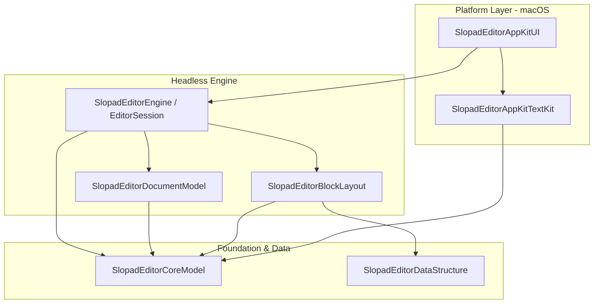

# 0002 - Keep the SwiftPM Target Graph as the Architecture Boundary

Date: 2026-07-08

## Status

Accepted

## Context

The source tree used to carry broad internal coupling because editor semantics, layout
projection, public vocabulary, data structures, TextKit implementation, and demo code
were not enforced by the compiler as separate modules.

The production dependency graph is:

Arrows show direct SwiftPM target dependencies. Debug apps, benchmarks, tests, and the
downstream fixture consume this graph from its outer edge; they do not define production
ownership.

## Decision

Keep the SwiftPM targets aligned to ownership:

- `SlopadEditorCoreModel`: public vocabulary, backend seam values, package canonical document
  values.
- `SlopadEditorDocumentModel`: semantic document/selection/command/history owner.
- `SlopadEditorBlockLayout`: layout projection, visible order, invalidation, geometry, text
  measurement cache, height index owner.
- `SlopadEditorDataStructure`: pure data structures with no editor vocabulary.
- `SlopadEditorEngine`: public `EditorSession` facade and orchestration.
- `SlopadEditorAppKitTextKit`: AppKit/TextKit2 text layout/rendering backend.
- `SlopadEditorAppKitUI`: reusable AppKit view/controller adapter.
- `SlopadDebugApp`: AppKit reference/debug host.
- `SlopadUIBenchmarkApp`: AppKit UI benchmark harness.

Use Swift `package` access for cross-target internal interfaces. Use `public` only for
host-facing Session contracts, public vocabulary, backend seam values, and intentional
platform host surfaces such as the AppKit controller, style, and chrome contract.

## Consequences

- `SlopadEditorDocumentModel` must not import `SlopadEditorBlockLayout`.
- `SlopadEditorBlockLayout` must not import `SlopadEditorDocumentModel`.
- `SlopadEditorEngine` may compose both owners and translate between semantic change facts and
  layout invalidation facts.
- `SlopadEditorAppKitTextKit` implements the CoreModel backend seam and must not depend on
  `SlopadEditorEngine`; adapting Session render descriptors to TextKit calls belongs to
  `SlopadEditorAppKitUI`.
- A complete platform replacement adds a sibling adapter that depends on `SlopadEditorEngine`
  and a coherent backend. It does not add platform dependencies to the engine or turn the
  default AppKit chrome hook into a renderer seam.
- `SlopadEditorCoreModel` is not a shared helper bucket. A value belongs there only when it is
  public vocabulary, a backend seam value, or package canonical document state.
- Any new public/package surface needs producer, consumer, invariant, and dependency
  direction evidence.
