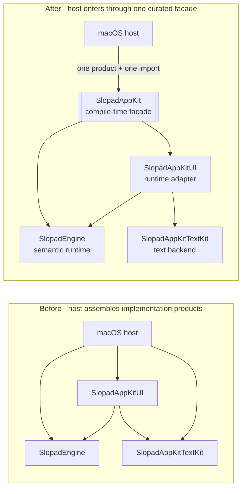
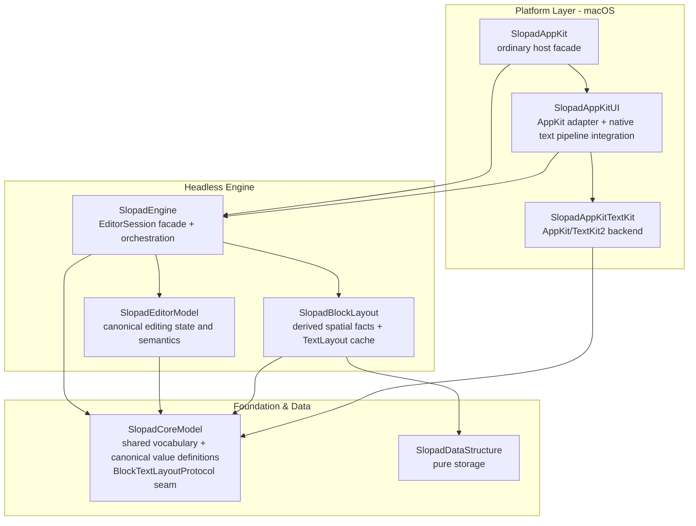
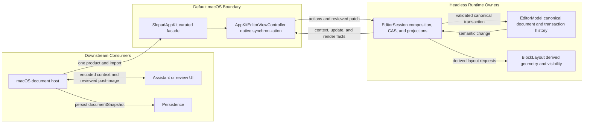

<p align="center">
  
</p>

<h1 align="center">Slopad</h1>

<p align="center">
  WIP Swift block text editor app, currently focused on its reusable editor engine.
</p>

<p align="center">
  
  
  
  
</p>

Slopad is a work-in-progress Swift app project for a block text editor. The app layer is
still early; most of the current codebase is the reusable editor foundation that the app
will use.

That foundation is `SlopadEngine`: a headless block editor engine for
Notion/Craft-style editors where the document is a tree of blocks, the engine owns editing
semantics, and platform code supplies native input, drawing, and text layout.

The engine is designed to stay platform-independent. A complete platform integration has
two coherent edge pieces: a native UI adapter that translates platform callbacks into
engine inputs, and a text layout backend that satisfies `BlockTextLayoutProtocol`.

The current project proves that path on macOS with AppKit UI and a TextKit2 text layout
backend. Ordinary macOS hosts depend on and import the `SlopadAppKit` platform facade.
It assembles the default `SlopadAppKitUI` adapter and `SlopadAppKitTextKit` backend into
one supported host surface; downstream hosts normally customize only style and block
chrome. A host uses the underlying products directly only for compatibility or when it
builds a complete custom platform adapter.

### AppKit Integration at a Glance

The facade changes how an ordinary app assembles the default stack, not which layer owns
runtime behavior:



`SlopadAppKit` contains aliases and curated entry points; it creates no second controller,
Session, document, or layout cache. The underlying products stay available for a host
that intentionally implements a complete custom adapter.

## Demo


```sh
swift run SlopadDebugApp
```

## Current Focus

SlopadEngine owns the semantic editor model:

- block document state and block identity
- caret, text selection, and block selection
- keyboard, pointer, native command, and IME/composition semantics
- command application, undo/redo, and semantic change projection
- committed full-document revision signals and viewport-independent canonical snapshots
- block layout orchestration, hit testing, reveal geometry, and render snapshots

The engine does not own platform widgets. A host view receives native callbacks,
translates them into engine input values, asks the engine for layout/render/hit-test
facts, and applies those facts through its platform adapter. In the default macOS path,
hosts enter through `SlopadAppKit`; `SlopadAppKitUI` performs that work with
`SlopadAppKitTextKit`.

## Engine Architecture



Arrows show direct SwiftPM target dependencies. Debug apps, benchmarks, tests, and the
downstream fixture are outer-edge consumers and are omitted from the production graph.

### Layer Responsibilities

| Layer             | Owner                 | Responsibility                                                                                                                                                        |
| ----------------- | --------------------- | --------------------------------------------------------------------------------------------------------------------------------------------------------------------- |
| Platform Layer    | `SlopadAppKit`        | Recommended ordinary macOS host product and import. It exposes the curated controller, action, style, chrome, selection, update, and snapshot vocabulary for the default stack. |
| Platform Layer    | `SlopadAppKitUI`      | Reusable AppKit callback, IME transport, native text pipeline, fragment/feedback drawing order, focus/scroll synchronization, and block chrome adapter; also retained as an advanced/compatibility product. |
| Platform Layer    | `SlopadAppKitTextKit` | AppKit/TextKit2 backend for measurement, line fragments, caret/selection rects, hit testing, Unicode navigation facts, attributed content, and drawing helpers; it owns no native input host. |
| Engine Layer      | `SlopadEngine`        | Host-facing `EditorSession` facade. It accepts native-independent input, composes semantic and layout owners, and returns render, hit-test, reveal, and redraw facts. |
| Engine Layer      | `SlopadEditorModel`   | Canonical document, selection, command, transaction, history, and semantic change owner.                                                                              |
| Engine Layer      | `SlopadBlockLayout`   | Visible order, y/height geometry, invalidation, reveal/hit-test geometry, marker projection, text-layout cache, and block height index owner.                         |
| Foundation & Data | `SlopadCoreModel`     | Shared public vocabulary, canonical `Document`/`Block` values, and backend seam values such as `BlockTextLayoutProtocol`.                                             |
| Foundation & Data | `SlopadDataStructure` | Pure storage such as `PrefixSumRedBlackTree`, with no editor, layout, or platform vocabulary.                                                                         |

`SlopadEditorModel` and `SlopadBlockLayout` do not import each other. `EditorSession`
combines their results and translates semantic changes into layout invalidation.

### Architecture Philosophy

- One meaning has one authority. Projections and caches may describe canonical state but
  do not become competing owners.
- The engine owns editing meaning; platform adapters own native callback transport,
  drawing, focus, and scroll mechanisms.
- A text backend keeps measurement, line fragments, hit testing, caret/selection rects,
  physical/linguistic navigation, and drawing coherent for the same effective text request;
  it is not a paint callback.
- Layout-derived bidi traversal context is retained only by `EditorSession` while its
  selection and effective text request match; it is not part of the canonical document or
  selection model.
- SwiftPM dependencies and access levels enforce the architecture: `public` is a host
  contract, `package` is a real cross-target owner interface, and implementation details
  stay target-internal.
- Public AppKit operations are atomic adapter boundaries whose Session snapshot,
  viewport, canvas, native input, focus, and observer effects agree when they return.
  Ordinary hosts submit context-free `AppKitEditorAction` values; the controller supplies
  adapter-owned viewport facts when an engine command needs them.

See [`docs/ARCHITECTURE.md`](docs/ARCHITECTURE.md) for runtime ownership, extension versus
replacement boundaries, and the change decision checklist.

On macOS, host-defined block appearance is deliberately limited to chrome through
`AppKitBlockChromeRenderer`: backgrounds, borders, gutter markers, and similar decoration.
`SlopadAppKitUI` clips and isolates that hook, then always performs its TextKit2
fragment-based text drawing plus text-selection and caret feedback. Live marked text is
included in the effective content sent through the same adapter-owned text drawing path.
`AppKitEditorViewController` owns one coherent `AppKitTextSystem`; one
`AppKitEditorStyle` configures TextKit2 geometry, text drawing, IME decoration, and the
style passed to block chrome together.

A host that needs to replace the entire native text pipeline must build its own platform
adapter around `EditorSession`. That adapter must keep layout, drawing, hit testing,
caret/selection geometry, and native text geometry coherent. The high-level chrome hook
is not a partial text-renderer replacement point.

Public controller mutations are synchronized host operations. `perform(_:)` accepts
`AppKitEditorAction`, and `commitActiveComposition()` provides the explicit host lifecycle
flush without exposing raw IME events. `resetDocument` returns only after the replacement
Session snapshot, canvas, native text surface, responder state, and snapshot observer are
synchronized. `scrollDocument` returns only after the viewport, visible snapshot, canvas,
and snapshot observer are synchronized, while preserving live marked text, native
selection, and current responder ownership. `updateEditorStyle` atomically replaces the
AppKit text system and synchronizes the resulting surface with the same preservation
guarantees. Raw `EditorInputEvent`, `currentViewport`, and unsynchronized
`...WithoutRendering` helpers are not public controller APIs. `EditorSession` still
accepts raw engine input for hosts implementing a custom adapter.

The ordinary host surface is organized by intent rather than by native callback type:

| Host intent | Public AppKit contract | Owner behind the contract |
| --- | --- | --- |
| Create or replace a document | `init`, `resetDocument` | Controller synchronizes a new `EditorSession` and native surface |
| Move programmatic focus | `focus(blockID:offset:)` | Session owns selection meaning; AppKit owns responder and reveal |
| Perform a programmatic edit | `perform(_:)` with `AppKitEditorAction` | Controller supplies viewport; Session applies semantics |
| Drop selection without moving focus | `perform(.clearSelection, makeFirstResponder: false)` | Session owns the transition to inactive; responder ownership is untouched |
| Flush marked text before save/switch/close | `commitActiveComposition()` | Session commits; controller re-synchronizes canonical native text |
| Change default text presentation | `updateEditorStyle(_:)` | One `AppKitTextSystem` replaces layout and drawing together |
| Customize block decoration | `AppKitBlockChromeRenderer` | Host draws clipped chrome; adapter still draws text and feedback |
| Observe and persist | `onUpdate`, `snapshot`, `documentSnapshot` | Render state and complete canonical state remain separate projections |
| Review and atomically apply an external edit | `documentContextSnapshot()`, `applyDocumentPatch(_:)` | Session owns CAS; EditorModel validates and commits one full post-image transaction |

Canonical persistence content is a separate public projection from render snapshots.
`EditorUpdate.committedDocumentRevision` advances only for committed content or structure
changes. A Session host can then read `EditorSession.documentSnapshot`; an AppKit host can
read `AppKitEditorViewController.documentSnapshot` synchronously from `onUpdate`. The
snapshot contains every canonical block in depth-first preorder and excludes selection,
viewport, layout, scroll, and live IME composition. `visibleBlocks` is never a persistence
source. Revisions are monotonic only within one Session and are not host storage revisions.

### Reviewable Document Transactions

External assistants and other review-before-apply workflows use a sibling contract rather
than mutating `EditorModel` or replaying low-level commands:



The facade and context values are boundaries, not additional state owners. The canonical
document changes only in `EditorModel`; `EditorSession` authorizes the reviewed patch and
projects the result, while the controller makes the native surface agree before returning.

```swift
let context = try controller.documentContextSnapshot()

// Build and review a complete canonical DFS post-image from context.document and
// context.selectedContent before applying it.
let patch = EditorDocumentPatch(
    source: context.source,
    replacementBlocks: reviewedBlocks,
    selectionAfter: reviewedSelection
)
let update = try controller.applyDocumentPatch(patch)
```

The source token is opaque and bound to the exact Session instance, committed document
revision, and captured selection. A document commit, selection-only move, or
`resetDocument` makes it stale. Query and apply reject active composition with a typed
error; an AppKit host calls `commitActiveComposition()` and captures a new context.

`selectedContent` preserves reviewable structure. A cross-block text selection becomes
canonical-order fragments with source ranges and fragment-relative inline marks. A block
selection removes descendant duplicate roots and includes each selected subtree in full
canonical DFS order. Applying a changed full post-image is one model transaction, one
committed revision, and one AppKit update callback; one undo restores the complete prior
document and selection. An exact document-and-selection no-op produces no revision,
history entry, callback, or render synchronization.

Context and selected-content values are output-only Session projections. Their public
fields can be encoded for a review service, but their initializers and unchecked decoding
are not public. Only `EditorDocumentPatch` is a host-constructed input. Patch validation
also rejects a block whose mutable `BlockContent` marks are no longer normalized for its
current text.

The two full-document reads have deliberately different lifetimes:

| API | Purpose | Includes selection | Valid for later mutation |
| --- | --- | --- | --- |
| `documentSnapshot` | Persistence/debounced storage | No | No; revision is only an observation signal |
| `documentContextSnapshot()` | Review and optimistic atomic apply | Yes, plus structured selected content | Yes, only through its exact opaque source token |

SwiftPM keeps these responsibilities in separate targets. An ordinary macOS target needs
one product dependency and one import:

```swift
.product(name: "SlopadAppKit", package: "Slopad")
```

```swift
import SlopadAppKit
```

`SlopadAppKitUI`, `SlopadAppKitTextKit`, and `SlopadEngine` remain public products for
existing integrations and advanced custom-adapter work. See `Package.swift` for the exact
product and target list.

## Development Targets

The repository also keeps benchmark and debug targets for development convenience. They
validate the current AppKit/TextKit2 path and performance behavior, but they do not define
engine semantics.

Benchmark targets:

- `SlopadUIBenchmarkApp`: AppKit UI benchmark harness for frame loops, CSV output, and
  display flush checks.
- `SlopadHeightBenchmark`: block height/index benchmark executable under `Benchmarks/`.
- `SlopadSessionBenchmark`: engine/session benchmark executable under `Benchmarks/`.

Debug target:

- `SlopadDebugApp`: macOS reference/debug host for scenarios, screenshots, and state
  assertions.

## Documentation

- `AGENTS.md`: working conventions for agents.
- `docs/ARCHITECTURE.md`: detailed target graph, runtime ownership, platform extension
  boundary, and architecture philosophy.
- `ADR/`: accepted architecture decisions.
- `docs/LOOP_REQUEST_TEMPLATE.md`: copy-paste template for bounded loop requests.
- `docs/ROADMAP.md`: achieved milestones, current product direction, and open risks.
- `docs/LESSONS_LEARNED.md`: failure patterns from past cleanup/refactor work.

## Development Checks

`Fixtures/DownstreamAppKitHost` is a compile-only consumer of the intended public host
surface. It must not rely on `@testable` imports or package-only APIs.

```sh
swift package dump-package
swift test --quiet
swift build --product SlopadAppKit --quiet
swift build --product SlopadAppKitTextKit --quiet
swift build --product SlopadAppKitUI --quiet
swift build --product SlopadDebugApp --quiet
swift build --product SlopadUIBenchmarkApp --quiet
swift build --package-path Fixtures/DownstreamAppKitHost --product DownstreamAppKitHost --quiet
git diff --check
```
