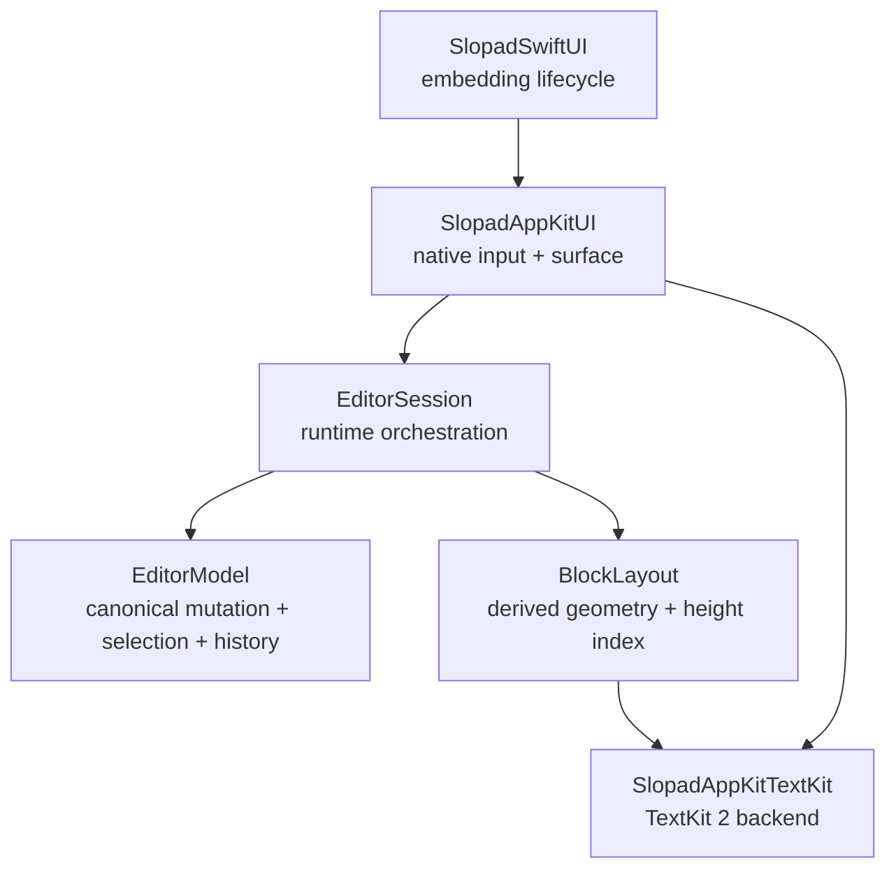
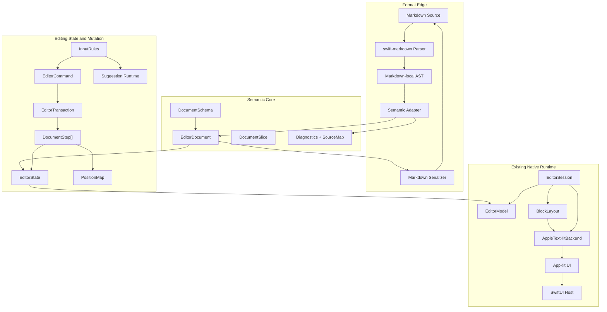

# Slopad Semantic Editor Architecture Handoff

> [!IMPORTANT]
> **이 문서는 근거 기록이지 작업 지시서가 아니다.**
>
> 작업 지시의 SSOT는 [`docs/ROADMAP.md`](docs/ROADMAP.md)와 [`ADR/`](ADR/), 그리고 [Epic #23](https://github.com/hot666666/Slopad/issues/23)이다.
> 이 문서는 그 결론에 이르게 된 배경과 논거를 남기기 위해 유지한다.
>
> - **정정 기준일:** 2026-08-07
> - **대조 커밋:** `main` @ `461cb57`
> - **정정 내역:** 아래 「정정 이력」 참조. 원 서술 중 소스와 어긋난 11건을 수정했다.

## 정정 이력

`main` @ `461cb57`의 실제 소스와 대조해 확인된 오류다. 각 항목은 본문 해당 절에 `정정` 블록으로 표시했다.

| ID | 원 서술 | 실제 | 반영 위치 |
| --- | --- | --- | --- |
| A1 | Phase 0 「기준선 통합」이 필요하다 | `git diff origin/main origin/claude/epic8` = 0줄. PR #22로 병합 완료 | §2.1, §15 Phase 0 |
| A2 | 명령 계층을 새로 만들어야 한다 | `EditorCommand` 18 케이스와 `apply([Step])`이 이미 트랜잭션·undo 1회·롤백을 제공한다 | §3.4, §7 |
| A3 | (언급 없음) | inline mark를 편집 중 생성할 수 없다. `applyTextStyle` 호출부가 테스트뿐 | §6.0 신설 |
| A4 | `BlockTextLayoutKey`를 새로 도입한다 | `PreparedLayoutKey = (BlockMeasureRequest, TextKitEditorStyle)`가 이미 더 강한 값 키다 | §11.3 |
| A5 | AppKit UI는 rendering만 소비한다 | AppKit UI가 geometry 4종을 직접 호출한다 | §11.1 |
| A6 | 현재 기반이 strikethrough·highlight에 적합하다 | `InlineMark.Kind`에 `strikethrough`가 없다 | §6.2 |
| A7 | `EditorDocument`·`Document`·`[EditorBlockInput]` 3중 authority | `EditorDocument` 타입 자체가 없다 | §3.1 |
| B1 | `DocumentStep` + `PositionMap`을 만든다 | 좌표계 미정. §18이 전역 정수 좌표를 금지하므로 착수 불가 | §3.5 |
| B2 | prepared layout 공유 여부를 benchmark로 정한다 | 단일 슬롯 × 컨텍스트 2개라 공유 여부는 자명. 개수·축출만 실험 대상 | §11.4 |
| B5 | byte-exact 왕복이 「필요하면」 | 필요 여부가 미결정인 채 §13 저장 원본 선택이 이에 종속되어 있다 | §6.4, §13 |
| B6 | Phase 6에 `swift-markdown` 의존성 한 줄 | 저장소의 첫 외부 의존성이며 ADR 항목이 없다 | §5.1 |

---

- **문서 상태:** 근거 기록 (작업 SSOT 아님)
- **작성 기준일:** 2026-08-07
- **주 대상:** Slopad를 분석·개선하는 후속 Agent 및 개발자
- **관련 저장소:**
  - Slopad: <https://github.com/hot666666/Slopad>
  - BlockEditorKit: <https://github.com/hot666666/BlockEditorKit>
- **핵심 참고 구현:**
  - ProseMirror: <https://prosemirror.net/>
  - Swift Markdown: <https://github.com/swiftlang/swift-markdown>

---

## 0. 문서 목적

이 문서는 다음 작업자가 기존 논의를 다시 처음부터 반복하지 않고, Slopad의 현재 상태와 개선 방향을 동일한 전제에서 이어갈 수 있도록 작성한 인계 문서다.

핵심 목표는 Slopad를 다음과 같이 재정의하고 단계적으로 개선하는 것이다.

> **Slopad는 Markdown 문자열 자체를 편집 상태로 사용하는 에디터가 아니라, Markdown을 의미 기반 문서로 해석하고 네이티브 블록·인라인 모델로 편집한 뒤 다시 Markdown으로 직렬화하는 편집기다.**

이를 한 문장으로 표현하면 다음과 같다.

> **Markdown-semantic + Native block editor**

이 문서에서 다루는 내용은 다음과 같다.

1. 지금까지의 의사결정 흐름
2. 현재 Slopad 구조에서 유지할 부분과 다시 설계할 부분
3. BlockEditorKit에서 참고할 부분과 반면교사로 삼을 부분
4. ProseMirror의 모듈 분리를 Swift 네이티브 에디터에 적용하는 방법
5. Markdown 파싱·인라인 처리·InputRule·Slash command 설계
6. 현재 Slopad TextKit 구조와 BlockEditorKit 제안 구조의 차이
7. TextKit capability 분리와 prepared layout 재사용을 판단하는 기준
8. 단계별 구현 순서·검증 기준·금지사항

---

# 1. 대화와 의사결정 흐름

## 1.1 TodoMate Memo의 렌더링 방향

초기 논의는 TodoMate의 Memo에서 네이티브 블록 기반으로 처리하는 것에대해 

최종적으로 콘텐츠의 **canonical 표현 언어**를 기준으로 구분하는 방향이 적절하다고 정리했다.

| 제품 영역 | 콘텐츠 성격 | 기본 런타임 |
| --- | --- | --- |
| TodoMate Memo | Markdown 기반 장문 편집 문서 | 네이티브 블록 에디터 |
| TodoMate의 복잡한 시각화 | 문서 안의 독립 artifact block | 해당 block만 WKWebView |

따라서 TodoMate Memo를 위한 Slopad는 브라우저를 재구현하는 도구가 아니라 다음 역할을 가져야 한다.

```text
Markdown
   ⇅
Semantic EditorDocument
   ⇅
Native Block Editor
```

HTML artifact는 일반 text/inline 처리에 섞지 않고 독립 block으로 취급한다.

```text
MemoDocument
├─ heading
├─ paragraph
├─ checklist
├─ code
├─ table
└─ htmlArtifact
      ↓
    WKWebView
```

## 1.2 Slopad의 기존 구현 이후 재설계 필요성

Slopad는 다음 순서로 발전했다.

```text
일단 동작하는 네이티브 편집기 구현
→ Engine / Model / Layout / AppKit / TextKit 경계 정리
→ SwiftUI embedding interface 추가
→ 다시 semantic document·format·input architecture 재검토
```

현재 문제는 네이티브 입력·선택·IME·TextKit 동작이 부족한 것이 아니라, 그 위에 다음 계층이 충분히 정리되지 않았다는 데 있다.

```text
Format
Schema
Inline semantics
Command
InputRule
Transaction
Serializer
```

## 1.3 BlockEditorKit과 ProseMirror를 참고하게 된 이유

BlockEditorKit은 외부 입력을 다음 경로로 canonical document에 매핑하는 관점을 명시적으로 설계했다.

```text
Source
→ Parser
→ format-local AST / DOM / IR
→ Format Adapter
→ BlockDocument
→ Encoder
```

반면 Slopad는 현재 host가 `[EditorBlockInput]`을 직접 만들어 주는 형태이며, Markdown parser·semantic adapter·serializer가 정식 architecture로 존재하지 않는다.

ProseMirror는 여기서 한 단계 더 나아가 다음을 별도 모듈로 구분한다.

```text
model
state
transform
commands
inputrules
keymap
history
markdown
view
```

Slopad는 ProseMirror의 DOM 구현을 복사하는 것이 아니라, **문서·상태·변환·명령·입력 규칙·포맷·표시의 책임 분리**를 Swift 네이티브 환경에 맞게 적용해야 한다.

## 1.4 추가 논의로 확정된 세부 방향

후속 논의에서 다음 세부 방향이 추가되었다.

1. 전체 Markdown parser를 직접 작성하지 않는다.
2. `swift-markdown`은 `SlopadMarkdown` 내부 parser 구현으로 사용한다.
3. AST → semantic document adapter, serializer, input rule은 Slopad가 직접 작성한다.
4. `/` 메뉴는 platform 전용 기능이 아니다.
5. Slash trigger·query·command 의미는 runtime, 실제 메뉴 표시는 AppKit/UIKit이 담당한다.
6. 현재 Slopad의 `BlockTextLayoutProtocol`은 소비자 기준으로 지나치게 넓다.
7. 외부 capability 계약은 분리하되, TextKit 내부 prepared state 공유는 benchmark로 검증한 뒤 결정한다.

---

# 2. 현재 Slopad 기준선

## 2.1 기준선 — 이미 통합되어 있음

> [!NOTE]
> **정정 A1.** 원 서술은 `claude/epic8`을 아직 통합해야 할 별도 기준선으로 다루고, 통합 전에는 새 target을 추가하지 말라는 게이트를 걸었다. 그 게이트는 이미 열려 있다.

`claude/epic8`은 PR #22(`14f980a`)로 `main`에 squash merge되었고 **두 브랜치의 트리는 동일하다.**

```bash
# 병합 시점(14f980a) 기준
$ git diff --stat origin/main origin/claude/epic8
(출력 없음 — 트리 동일)
```

`main`은 그 뒤로 진행했으므로 오늘 같은 명령을 그대로 실행하면 차이가 나온다. 판단 기준은 **병합 시점의 트리 동일성**이다.

squash merge이므로 `git log origin/main..origin/claude/epic8`은 비어 있지 않게 나온다. 그 명령으로 판단하면 안 되고, 위의 트리 비교가 기준이다.

- `main`: PR #7 및 epic #8 전체(Session epoch, focus, unhandled action, content height, SwiftUI product, embedding ADR)가 반영된 현재 라인
- `claude/epic8`: 병합 완료된 작업 브랜치. 더 이상 갱신되지 않으며 참조하지 않는다

후속 작업은 `main`을 기준으로 분기한다. 기준선 통합은 남은 작업이 아니다.

관련 PR:

- Platform·Engine 경계 정리: <https://github.com/hot666666/Slopad/pull/7>
- Session epoch: <https://github.com/hot666666/Slopad/pull/15>
- Focus contract: <https://github.com/hot666666/Slopad/pull/16>
- Unhandled action: <https://github.com/hot666666/Slopad/pull/17>
- Content height: <https://github.com/hot666666/Slopad/pull/18>
- SwiftUI product: <https://github.com/hot666666/Slopad/pull/19>
- Embedding ADR: <https://github.com/hot666666/Slopad/pull/20>
- epic8 통합: <https://github.com/hot666666/Slopad/pull/22>

**남은 기준선 작업은 baseline 태그를 찍는 것뿐이다.** 통합 자체는 완료되었다.

## 2.2 현재 유지 가치가 높은 runtime ownership

현재 Slopad의 핵심 owner 분리는 유지해야 한다.



### `EditorModel`

소유해야 하는 것:

- canonical document
- canonical selection
- semantic command application
- transaction
- undo/redo
- block split·join·indent·outdent·move·delete
- inline mark mutation

소유하면 안 되는 것:

- TextKit 객체
- viewport
- AppKit callback
- caret rectangle
- drawing cache

### `BlockLayout`

소유해야 하는 것:

- visible order
- block height·y offset
- height index
- viewport query
- layout invalidation
- scalar measurement cache

소유하면 안 되는 것:

- canonical mutation
- text navigation 의미
- TextKit prepared object
- selection state

### `EditorSession`

소유해야 하는 것:

- native-independent input orchestration
- composition overlay
- command dispatch
- model change → layout invalidation 변환
- geometry/navigation/deletion query 조정
- snapshot·update publication
- suggestion runtime 상태

### `SlopadAppKitUI`

소유해야 하는 것:

- AppKit event 번역
- first responder
- `NSTextInputClient`
- native marked text mirror
- focus·scroll·canvas 동기화
- overlay UI 배치
- slash menu·mention menu 등 platform presentation

### `SlopadSwiftUI`

소유해야 하는 것:

- document identity guard
- Session epoch staleness 방지
- committed update filtering
- composition flush
- focus bridge
- observable projection

관련 파일:

- <https://github.com/hot666666/Slopad/blob/main/Sources/SlopadSwiftUI/SlopadDocument.swift>
- <https://github.com/hot666666/Slopad/blob/main/Sources/SlopadSwiftUI/SlopadEditor.swift>
- <https://github.com/hot666666/Slopad/blob/main/docs/ARCHITECTURE.md>

---

# 3. 현재 구조에서 다시 설계해야 하는 부분

## 3.1 하나의 canonical semantic document가 필요함

현재 public 입력은 다음 형태다.

```swift
public struct EditorBlockInput {
    public let id: BlockID
    public let parentID: BlockID?
    public let kind: BlockKind
    public let content: BlockContent
}
```

관련 파일:

- <https://github.com/hot666666/Slopad/blob/main/Sources/SlopadCoreModel/Document/EditorBlockInput.swift>

내부에는 별도 package-private `Document`가 존재한다.

- <https://github.com/hot666666/Slopad/blob/main/Sources/SlopadCoreModel/Document/Document.swift>

> [!NOTE]
> **정정 A7.** 원 서술은 `EditorDocument`·`Document`·`[EditorBlockInput]` 세 표현이 authority를 나눠 갖는다고 했지만, **`EditorDocument`라는 타입은 존재하지 않는다.**
>
> ```text
> $ rg '\bEditorDocument\b' Sources
>   EditorDocumentSnapshot    Session 호스트 계약 (읽기 전용 스냅샷)
>   EditorDocumentRevision    단조 리비전
>   EditorDocumentPatch       에이전트 post-image
>   EditorDocumentSource      CAS 토큰
>   → 정본 문서 타입 EditorDocument: 없음
> ```
>
> authority는 `Document`(package) 하나이고 `EditorBlockInput`은 이미 생성 DTO다. 즉 이 절이 걱정한 상태는 이미 아니다.
>
> **실제 문제는 둘이다.**
> 1. `Document`가 `package`라 `SlopadMarkdown` target이나 호스트가 볼 수 없다.
> 2. `EditorBlockInput`이 트리를 `parentID` 평면 배열로 표현해 **형제 순서가 배열 순서에 의존**한다(`Document.swift:22`). 게다가 이 순서는 `EditorDocumentTransactionError.noncanonicalDepthFirstOrder`로 **검증까지 된다**. Markdown 어댑터가 이것을 출력 타입으로 쓰려면 그 규칙을 명시적으로 지켜야 한다.
>
> 따라서 필요한 작업은 새 `EditorDocument`를 만드는 것이 아니라 **`Document`의 노출 경계를 정하는 것**이다. → Epic #23 / 이슈 #30

원 서술을 위 정정에 맞춰 읽으면, 목표는 하나의 canonical semantic document이며 그것은 이미 `Document`다.

`EditorBlockInput`은 다음 역할 중 하나로 축소한다.

- construction DTO
- legacy compatibility API
- codec adapter의 임시 결과
- migration input

## 3.2 Document schema가 없음

현재 `BlockKind`는 닫힌 enum이다.

```text
paragraph
heading
unordered list item
ordered list item
quote
code block
divider
todo
```

관련 파일:

- <https://github.com/hot666666/Slopad/blob/main/Sources/SlopadCoreModel/Document/BlockKind.swift>

향후 다음 block을 추가할 때마다 core enum이 수정될 수 있다.

- image
- table
- attachment
- callout
- document/project reference
- HTML artifact
- diagram
- product-specific block

따라서 다음 semantic schema가 필요하다.

```text
DocumentSchema
├─ BlockSpec
├─ MarkSpec
├─ allowed child relation
├─ allowed content
├─ allowed marks
├─ block attributes
├─ atomic / selectable / text-capable
└─ schema version
```

단, 모든 built-in을 문자열 ID와 dynamic JSON payload로 바꾸는 방식은 피한다.

권고 방향:

```text
강타입 built-in block
+
제한된 extension block
```

## 3.3 Markdown 문법이 EditorModel에 직접 결합되어 있음

현재 prefix shortcut은 `EditorModel`이 직접 처리한다.

관련 파일:

- <https://github.com/hot666666/Slopad/blob/main/Sources/SlopadEditorModel/MarkdownShortcut/EditorModel%2BMarkdownPrefixShortcuts.swift>

현재 동작:

```text
"# "   → heading
"- "   → unordered list
"> "   → quote
"[ ] " → todo
"```"  → code block
```

이 구현은 다음 책임을 섞는다.

```text
Markdown syntax recognition
+ rule matching
+ document mutation
+ selection mutation
```

목표는 다음과 같다.

```text
InputRule
→ EditorCommand
→ EditorTransaction
→ EditorModel apply
```

## 3.4 Input transport와 semantic command가 섞여 있음

현재 `EditorInputEvent`에는 다음이 함께 존재한다.

- text insert/replace
- paste/cut
- delete
- Enter/Tab
- navigation
- pointer selection
- block drag
- IME lifecycle
- undo/redo

관련 파일:

- <https://github.com/hot666666/Slopad/blob/main/Sources/SlopadCoreModel/Interaction/EditorInputEvent.swift>

목표 구조:

```text
NativeInputIntent
→ Command / InputRule
→ Transaction
→ DocumentStep[]
→ EditorModel
```

> [!NOTE]
> **정정 A2.** 이 경로의 중간 계층은 **이미 존재한다.** 없는 것이 아니라 `package` 가시성에 갇혀 있고, 이름이 충돌한다.
>
> ```text
> EditorInputEvent.Command   public   CoreModel/Interaction   전송 + 일부 의미 (33 cases)
> EditorCommand              package  EditorModel/Command     의미 명령 (18 cases)
> EditorTransactionStep      package  EditorModel/History     .command | .replaceSelection
> ```
>
> `EditorModel+CommandApplication.swift:15`의 `apply([EditorTransactionStep])`은 이미 다중 명령을 **하나의 트랜잭션으로 묶고, 실패하면 문서·선택을 롤백하고, undo 1회를 보장**한다. §15 Phase 5가 목표로 적은 "one transaction = one undo"는 이미 동작 중이다.
>
> 주의할 이름 충돌 둘:
> - `Command`가 세 곳에서 다른 뜻으로 쓰인다.
> - `EditorTransactionStep`은 문서 델타가 아니라 **명령 매크로 녹음**이다. §3.5의 `DocumentStep`(invertible delta)과 이름이 거의 같아 혼동을 부른다.
>
> 따라서 필요한 작업은 새 계층 생성이 아니라 **기존 계층의 명명 정리와 승격**이다. → 이슈 #27

## 3.5 Change와 history가 coarse-grained함

현재 `EditorOperation`은 큰 동작 이름 위주다.

```text
splitBlock
mergeBlocks
indent
outdent
moveBlocks
deleteBlocks
replaceDocument
```

관련 파일:

- <https://github.com/hot666666/Slopad/blob/main/Sources/SlopadEditorModel/EditorOperation.swift>

Undo는 전체 before/after document snapshot을 저장한다.

- <https://github.com/hot666666/Slopad/blob/main/Sources/SlopadEditorModel/History/EditorTransaction.swift>

향후 필요한 구조:

```swift
public enum DocumentStep {
    case replaceText(...)
    case addMark(...)
    case removeMark(...)
    case setBlockKind(...)
    case setBlockAttributes(...)
    case insertBlock(...)
    case removeSubtree(...)
    case moveSubtree(...)
    case splitBlock(...)
    case joinBlocks(...)
}
```

각 step은 최소한 다음을 제공해야 한다.

```text
apply
changed regions
position mapping
possible inverse
typed failure
```

기존 snapshot history는 즉시 제거하지 않는다. Step 기반 history가 검증될 때까지 correctness fallback 또는 checkpoint로 유지한다.

> [!WARNING]
> **정정 B1 — 이 절은 현재 착수 불가다.**
>
> `PositionMap`을 어느 좌표계 위에 정의할지가 비어 있다.
>
> ```text
> Slopad 위치   TextPosition(blockID: BlockID, offset: Int)   ← 블록 로컬
> 이 절의 요구  DocumentStep + position mapping + inverse
> §18 금지사항  "ProseMirror 전역 정수 position 복제"          ← non-goal
> ```
>
> ProseMirror의 `Mapping`은 문서 전체가 하나의 정수 축이라는 전제 위에 성립한다. 그 전제를 거부하면 `splitBlock`·`joinBlocks`·`moveSubtree`가 위치를 어떻게 옮기는지 **정의할 방법이 없다** — 새 블록 ID는 step 실행 시점에 생성되기 때문이다.
>
> 게다가 `docs/ROADMAP.md`는 *"multi-block work is block selection, not cross-block text ranges"*를 유지하라고 못박았는데, §16.2의 검증 항목에는 "cross-block formatting"이 있어 서로 충돌한다.
>
> **확정 결정 D2: 크로스 블록 텍스트 범위는 도입하지 않는다.** 따라서 이 절은 Epic #23의 **비목표**이며, 현재 snapshot history를 유지한다. 좌표계 결정이 뒤집히지 않는 한 착수하지 않는다.

---

# 4. 목표 전체 아키텍처



---

# 5. Markdown 처리 방향

## 5.1 전체 parser를 직접 작성하지 않음

전체 CommonMark/GFM parser는 `swift-markdown`을 사용한다.

```text
Markdown Source
→ swift-markdown
→ Markdown AST
→ Slopad Semantic Adapter
→ EditorDocument
```

`swift-markdown`은 concrete parser 구현이며, public Slopad contract가 아니다.

`Markdown.Document`, `Markup`, `Paragraph`, `Strong`, `Emphasis` 등 parser 타입은 `SlopadMarkdown` target 밖으로 노출하지 않는다.

> [!NOTE]
> **정정 B6.** `swift-markdown`은 **이 저장소의 첫 외부 의존성**이다. 한 줄로 처리할 항목이 아니다.
>
> ```text
> Package.swift  package-level dependencies — 없음 (0개)
> swift-markdown → swift-cmark (C 라이브러리) 링크
> 전파 대상: SlopadMarkdown → 다운스트림 fixture 2개 → 호스트 앱
> ```
>
> 의존성 0개는 우연이 아니라 현재 패키지 그래프의 성질이다. 첫 서드파티 도입은 빌드 시간, strict concurrency / `Sendable`, 버전 핀, 최소 toolchain, 다운스트림 전파를 전부 건드린다. ADR 0002가 target 그래프를 다뤘듯 **의존성 경계도 ADR감**이다.
>
> §18이 "pin version과 최소 toolchain 미정"이라 적어둔 것을 §15 Phase 6이 그냥 넘겼다. **ADR을 먼저 쓴다.** → 이슈 #29
>
> 파서 타입 격리의 근거(위 문단)는 타당하므로 ADR에 그대로 옮긴다. 다만 target을 분리하는 목적은 **확장성이 아니라 격리**임을 명시한다 — 포맷 구현이 Markdown 하나뿐이므로 플러그인 protocol이나 registry는 만들지 않는다(확정 결정 D6).

## 5.2 Slopad가 직접 작성할 부분

```text
직접 작성
├─ Markdown AST → EditorDocument adapter
├─ Markdown block adapter
├─ Markdown inline adapter
├─ EditorDocument → Markdown serializer
├─ diagnostic 변환
├─ source range → canonical range mapping
├─ unsupported construct 정책
├─ custom block mapping
├─ block input rules
└─ inline input rules
```

## 5.3 전체 parsing과 실시간 input rule은 별도 기능

### 전체 parsing 사용처

- Markdown 파일 열기
- 전체 source import
- Markdown fragment paste
- semantic round-trip fixture

### InputRule 사용처

- `# ` 입력 후 heading 변환
- `- ` 입력 후 list 변환
- `**text**` 입력 후 strong mark 변환
- `` `text` `` 입력 후 code mark 변환

매 키 입력마다 전체 document를 `swift-markdown`으로 다시 parse하지 않는다.

```text
committed text
→ trigger 검사
→ 제한된 candidate 추출
→ local rule/parser
→ transaction
```

## 5.4 권고 `SlopadMarkdown` 구성

```text
SlopadMarkdown
├─ Parsing
│  └─ SwiftMarkdownParser
├─ Adapting
│  ├─ MarkdownBlockAdapter
│  └─ MarkdownInlineAdapter
├─ Encoding
│  └─ MarkdownSerializer
├─ Diagnostics
│  ├─ MarkdownDiagnosticMapper
│  └─ MarkdownSourceMap
└─ InputRules
   ├─ MarkdownBlockInputRules
   └─ MarkdownInlineInputRules
```

새 target의 근거는 `swift-markdown` dependency를 core 밖에 격리하고, parser AST가 runtime으로 누출되는 것을 compiler로 차단하기 위함이다.

---

# 6. Inline 처리 설계

## 6.0 선행조건 — 지금은 편집 중 mark를 만들 수 없다

> [!WARNING]
> **정정 A3.** 이 장 전체가 inline 의미론을 다루면서 정작 **도달 경로가 없다는 사실을 한 번도 적지 않았다.**

```text
$ rg 'applyTextStyle|clearTextStyles' Sources Tests

Sources/SlopadEditorModel/Command/EditorCommand.swift:14                정의
Sources/SlopadEditorModel/EditorModel+CommandApplication.swift:104      분기
Sources/SlopadEditorModel/Command/EditorModel+InlineStyleCommands.swift 구현
Tests/…/EditorModelInlineStyleCommandTests.swift                        ← 유일한 호출부
```

`BlockContent.InlineMark`도, TextKit 렌더 경로도, `applyTextStyle` 구현도 전부 있다. 그런데 그 사이를 잇는 입력 이벤트가 없다.

- `EditorInputEvent.Command`의 33개 케이스 중 inline 스타일 관련: **0개**
- paste 경로: `pasteText(String)` — 평문만

즉 **mark는 최초 `EditorBlockInput`으로 주입될 때만 생기고, 편집 중에는 절대 생성되지 않는다.**

이것은 단순 미구현이 아니라 **순서 문제**다.

```text
§6.7  실시간 inline InputRule      ┐
§6.10 Toolbar formatting           ├─ 전부 "범위에 mark를 적용하는
§15   Phase 7 인라인 InputRule     ┘   도달 가능한 경로"를 전제한다
                                       그 경로가 없으면 착수할 곳이 없다
```

`docs/ROADMAP.md`는 이미 이것을 P2로 잡아뒀으나 §15의 Phase 목록에는 빠져 있다. **Epic #23에서 이 항목이 최우선(이슈 #25)이다.**

## 6.1 문법·의미·효과 분리

Inline은 반드시 다음 세 계층으로 나눈다.

| 계층 | 예시 | owner |
| --- | --- | --- |
| Markdown syntax | `**text**` | `SlopadMarkdown` |
| Semantic meaning | `.strong(range)` | Core document |
| Native effect | bold font | TextKit style resolver |

```text
**text**
→ parser
→ text + strong range
→ style resolver
→ bold attributed run
```

Core document에는 다음을 저장하지 않는다.

- `**`, `_`, `` ` `` delimiter
- `NSFont`
- `NSColor`
- `NSAttributedString`
- TextKit object

## 6.2 현재 `text + marks` 기반은 재사용 가능

현재 `BlockContent`는 다음을 보유한다.

```text
text
marks
inlineRuns
```

관련 파일:

- <https://github.com/hot666666/Slopad/blob/main/Sources/SlopadCoreModel/Document/BlockContent.swift>

현재 기반(range 기반 mark)은 구조적으로 재사용 가능하다. 다만 **현재 어휘는 넷뿐이다.**

```swift
// BlockContent.InlineMark.Kind — 실제
case bold
case italic
case code
case link(destination: String)
```

> [!NOTE]
> **정정 A6.** 원 서술은 "현재 기반이 strong·emphasis·code·link·strikethrough·highlight 처리에 적합하다"고 적었는데, `strikethrough`와 `highlight`는 `Kind`에 **없다**. §15 Phase 7이 `~~strike~~` 변환을 요구하므로 어휘 추가가 선행되어야 한다.
>
> 그리고 어휘 이름이 `.bold`/`.italic`이다 — §6.1이 "의미와 네이티브 효과를 섞지 말라"고 못박은 바로 그 혼동인데 원 문서는 지적하지 않았다.

**확정 결정 D7 — 어휘 소유권.**

코어가 **의미로 정의한 닫힌 집합**이 어휘다. 포맷은 그 집합에 대해 두 가지로만 반응한다 — 표현 가능하거나, 표현 불가 → 진단. 포맷도 백엔드도 어휘를 늘리지 못하며, 늘리는 것은 코어의 결정이다.

이 방향은 이미 코드에 반쯤 서 있다. `TextKitAttributedStringBuilder.swift:109`가 `marks.contains(.bold) → boldFontMask`로 **해석만** 하고 저장하지 않는다.

Markdown과 HTML이 둘 다 표현할 수 있는 인라인 의미는 다섯이다.

| 의미 | Markdown | HTML | 현재 |
| --- | --- | --- | --- |
| strong | `**` | `<strong>` | `.bold` — 있음 |
| emphasis | `_` | `<em>` | `.italic` — 있음 |
| code | `` ` `` | `<code>` | `.code` — 있음 |
| link | `[](…)` | `<a>` | `.link` — 있음 |
| strikethrough | `~~` (GFM) | `<s>` | **없음** |
| underline | 없음 | `<u>` | 넣지 않는다 |
| highlight | 확장 문법 | `<mark>` | 넣지 않는다 |

**중립 어휘는 합집합이 아니라 "코어가 의미로 인정한 것"이다.** `<u>`·`<mark>`은 어휘 추가가 아니라 인코더 진단으로 처리한다(§14 출력 정책과 동일 원칙).

필요한 보강:

- `strikethrough` 추가 → 이슈 #25
- `.bold`/`.italic` → `.strong`/`.emphasis` 개명. Markdown만 쓰는 동안 실제 차이는 없으나 `Kind`가 `public Codable`이라 나중에 하면 마이그레이션이 붙는다. `strikethrough` 추가와 같은 PR에서 하면 비용이 사실상 0 → 이슈 #25
- stored marks → 이슈 #26 (`EditorState`)
- mark inclusivity / exclusion
- source map

`MarkSpec`과 inline atom은 Epic #23의 비목표다 — 첫 실제 소비자가 없다.

## 6.3 전체 Markdown import의 inline adapter

입력:

```markdown
A **bold _and italic_** word
```

AST 개념:

```text
paragraph
├─ text("A ")
├─ strong
│  ├─ text("bold ")
│  └─ emphasis
│     └─ text("and italic")
└─ text(" word")
```

Semantic 결과:

```text
text:
"A bold and italic word"

marks:
strong    2..<17
emphasis  7..<17
```

Adapter 알고리즘:

```text
1. 현재 canonical text offset 저장
2. child inline node 재귀 순회
3. child 순회 후 offset 확인
4. start..<end 범위에 semantic mark 추가
```

## 6.4 Markdown delimiter는 canonical text에서 제거

```text
source:    **bold**
canonical: bold
mark:      strong(0..<4)
```

결과:

- 화면 text offset과 semantic offset이 일치
- selection range가 delimiter를 고려하지 않음
- TextKit range와 canonical range를 직접 대응 가능
- Agent는 Markdown 문법이 아니라 semantic range를 수정
- serializer가 export 시 delimiter 재생성

`**bold**`와 `__bold__`는 기본적으로 같은 semantic document가 된다.

> [!NOTE]
> **정정 B5.** 원 서술은 "Byte-exact round-trip이 **필요하면** 별도 metadata로 관리한다"고 조건부로 남겨뒀는데, **필요 여부 자체가 결정되지 않았다.** 그리고 §13(저장 원본 A/B/C)이 정확히 이 결정에 종속된다 — 두 미결정이 서로를 기다린다.
>
> ```text
> §6.4  "byte-exact round-trip 이 필요하면"        ← 필요 여부 미결정
> §13   저장 원본 A(Markdown) / B(archive) / C(hybrid)  ← §6.4 에 의존
> §5.3  검증 기준 "semantic round-trip fixture"    ← 합격 조건 미정의
>
>   parse(serialize(doc)) == doc  인가
>   serialize(parse(md))  == md   인가
> ```
>
> `**bold**`와 `__bold__`가 같은 문서가 되는 순간, 저장 원본을 Markdown으로 두는 선택지(A)는 **사용자가 쓴 문법을 조용히 바꾼다.** 이것이 허용인지가 곧 A/B/C 선택이다.
>
> 더구나 Slopad는 stable `BlockID`를 이미 문서에 갖고 있고(에이전트 CAS가 이것을 쓴다) 평문 Markdown으로는 보존되지 않는다.
>
> **기본안: 의미 왕복만 보장한다.** 이 한 문장이 확정되면 §13의 나머지가 따라온다. 확정 전에는 §5.3의 round-trip fixture를 작성할 수 없다. → 이슈 #29

## 6.5 Source offset과 canonical offset 분리

Markdown source offset과 semantic text offset은 다르다.

```text
Source offset
→ Semantic canonical offset
→ TextKit UTF-16 offset
```

별도 source map이 필요하다.

```swift
struct InlineSourceMapEntry {
    let sourceRange: MarkdownSourceRange
    let canonicalRange: TextRange
}
```

용도:

- parse diagnostic 위치
- source mode ↔ rich mode 위치 연결
- paste selection 계산
- unsupported syntax 표시
- Agent citation mapping

한글·emoji·결합 문자 때문에 UTF-8, UTF-16, grapheme offset을 혼용하지 않는다.

## 6.6 중첩 mark

```markdown
**bold and _italic_**
```

```text
strong:   0..<15
emphasis: 9..<15
```

TextKit에는 mark range를 순서대로 덧칠하기보다 활성 mark 집합별 `InlineRun`을 전달한다.

```text
run 1: "bold and " → {strong}
run 2: "italic"    → {strong, emphasis}
```

## 6.7 실시간 inline InputRule

사용자가 다음을 입력했다고 가정한다.

```text
**TCP**|
```

처리:

```text
1. composition 종료 확인
2. caret 주변 candidate 추출
3. delimiter-aware matcher 또는 local inline parser 실행
4. opening delimiter 삭제
5. closing delimiter 삭제
6. semantic strong mark 추가
7. caret 위치 mapping
8. 하나의 transaction으로 commit
```

```text
EditorTransaction
├─ replaceText(candidateRange, "TCP")
├─ addMark(.strong, mappedRange)
└─ setSelection(mappedCaret)
```

한 번의 undo로 delimiter를 포함한 입력 전 상태를 복원해야 한다.

## 6.8 정규식만으로 Markdown emphasis를 처리하지 않음

다음 요소 때문에 단순 정규식만으로는 충분하지 않다.

- escape
- nested emphasis
- whitespace·punctuation 규칙
- code span
- 여러 개의 연속 `*`
- incomplete input
- link label

권고 방식:

```text
trigger-based candidate extraction
+
delimiter-aware local parser/matcher
```

## 6.9 IME 처리

```text
beginComposition
updateComposition
updateComposition
commitComposition
```

Live marked text 중에는 inline rule을 실행하지 않는다.

```text
composition live
→ rule 금지

composition commit
→ committed insert
→ rule 가능
```

## 6.10 Toolbar formatting과 stored marks

Toolbar Bold는 Markdown parser를 호출하지 않는다.

### selection이 있을 때

```text
toggleStrong
→ addMark/removeMark transaction
```

### caret만 있을 때

```text
storedMarks += strong
→ 다음 입력에 strong 적용
```

필요 상태:

```text
EditorState
├─ document
├─ selection
└─ storedMarks
```

## 6.11 Mark boundary 정책

MarkSpec은 경계 입력 포함 여부를 결정한다.

| mark | start | end |
| --- | ---: | ---: |
| strong | inclusive | inclusive |
| emphasis | inclusive | inclusive |
| code | 정책 결정 | 정책 결정 |
| link | inclusive | non-inclusive |

링크 끝에서 이어 입력한 글자가 계속 링크가 되는 문제는 `link.inclusiveEnd = false`로 제어한다.

## 6.12 Native effect 적용

```text
Block base style
+ active inline marks
+ theme/environment
→ InlineStyleResolver
→ attributed content
→ TextKit 2
```

예:

```text
strong        → bold trait
emphasis      → italic trait
code          → monospace + background
link          → link color + underline + destination
strikethrough → strikethrough
```

같은 attributed content를 다음 경로가 함께 사용해야 한다.

```text
measurement
line fragments
drawing
caret geometry
selection geometry
hit testing
```

## 6.13 Runtime decoration과 canonical mark 구분

저장하지 않는 것:

- selection background
- caret
- IME underline
- search highlight
- spell-check underline
- diagnostic underline
- collaborator cursor

이들은 runtime decoration이다.

```text
semantic attributed content
→ TextKit layout
→ search/diagnostic decoration
→ selection
→ composition
→ caret
```

## 6.14 Inline atom

다음은 mark가 아니다.

- inline image
- mention
- project reference
- inline formula
- badge
- footnote reference

장기적으로 다음 중 하나를 도입한다.

```swift
enum InlineNode {
    case text(String, marks: Set<InlineMark>)
    case hardBreak
    case atom(InlineAtom)
}
```

또는 현재 range 모델을 유지하면서 atom placement를 추가한다.

HTML artifact는 inline atom이 아니라 독립 block으로 유지한다.

---

# 7. Command·InputRule·Transaction

## 7.1 계층

```text
NativeInputIntent
→ EditorCommand / InputRule
→ EditorTransaction
→ DocumentStep[]
→ EditorModel
```

## 7.2 Command 결과

Boolean 하나로 `적용 불가`, `소비됨`, `변경 생성`을 표현하지 않는다.

```swift
enum CommandResult {
    case notApplicable
    case handledWithoutChange
    case transaction(EditorTransaction)
}
```

## 7.3 동일 command 재사용

```text
Slash menu ─────┐
Toolbar ────────┤
Keyboard ───────┼→ EditorCommand → Transaction
Agent action ───┘
```

Platform UI가 document를 직접 수정하지 않는다.

---

# 8. Slash command와 suggestion architecture

## 8.1 `/` 메뉴는 platform-only 기능이 아님

| 책임 | owner |
| --- | --- |
| `/`가 유효한 문맥인지 판단 | InputRule / Suggestion extension |
| query 추출 | EditorSession runtime |
| command 목록 | Command catalog |
| 현재 상태에서 실행 가능 여부 | EditorCommand |
| anchor geometry | Text geometry backend |
| 실제 메뉴 표시 | AppKit/UIKit |
| 선택 command 적용 | Transaction / EditorModel |
| undo | EditorModel history |

## 8.2 권고 흐름


## 8.3 Suggestion state는 canonical document가 아님

```swift
struct EditorSuggestionState {
    let id: SuggestionID
    let kind: SuggestionKind
    let triggerRange: DocumentRange
    let queryRange: DocumentRange
    let anchor: DocumentPosition
    let sourceRevision: DocumentRevision
}
```

저장하지 않는 값:

- 메뉴 frame
- hover index
- selected item index
- animation
- menu visible state

## 8.4 Query는 일반 text로 먼저 입력

```text
document text: "/hea"
runtime: slash suggestion active
```

Command 선택 시:

```text
Transaction
├─ replaceText("/hea", "")
├─ setBlockKind(heading h1)
└─ setSelection(start)
```

## 8.5 Platform 역할

AppKit:

- caret rect → window 좌표 변환
- overlay view/panel 배치
- scroll·resize 위치 갱신
- pointer·keyboard navigation
- accessibility
- animation
- first responder 유지

메뉴가 editor의 first responder를 빼앗지 않도록 한다.

## 8.6 키 라우팅

| 입력 | 처리 |
| --- | --- |
| 일반 문자 | editor insert 후 query 갱신 |
| Backspace | editor delete 후 query 갱신 |
| ↑ / ↓ | menu selection |
| Enter | command 실행 |
| Escape | suggestion dismiss |
| Tab | 제품 정책에 따라 실행/이동 |
| selection 이동 | dismiss |

## 8.7 재사용 가능한 suggestion subsystem

```text
/     → block command
@     → mention
[[    → document link
#     → tag
:     → emoji
```

각 trigger의 허용 문맥은 schema와 semantic rule이 판단한다.

---

# 9. 현재 Slopad TextKit 구조 분석

## 9.1 현재 넓은 protocol

현재 `BlockTextLayoutProtocol`은 다음을 모두 포함한다.

```text
measure
textFrame
lineFragments
caretRect
selectionRects
textPosition
textHitTest
navigate
wordRange
deletionRange
```

관련 파일:

- <https://github.com/hot666666/Slopad/blob/main/Sources/SlopadCoreModel/Layout/BlockTextLayoutProtocol.swift>

그러나 `BlockLayout`은 이 중 `measure`만 사용한다.

- <https://github.com/hot666666/Slopad/blob/main/Sources/SlopadBlockLayout/TextLayout/BlockLayout%2BTextMeasurement.swift>

현재 의존은 다음과 같다.

```text
BlockLayout 필요
└─ measure

BlockLayout 전달받음
├─ measure
├─ caret geometry
├─ selection geometry
├─ navigation
└─ deletion
```

이 계약은 소비자 기준으로 지나치게 넓다.

## 9.2 Layouter와 renderer가 별도 context를 소유

현재:

```text
TextKitBlockTextLayouter
└─ TextKitLayoutContext A
   ├─ measure
   ├─ caret
   ├─ selection
   ├─ hit test
   ├─ navigation
   └─ deletion

TextKitBlockRenderer
└─ TextKitLayoutContext B
   └─ drawing
```

관련 파일:

- <https://github.com/hot666666/Slopad/blob/main/Sources/SlopadAppKitTextKit/TextLayout/TextKitBlockTextLayouter.swift>
- <https://github.com/hot666666/Slopad/blob/main/Sources/SlopadAppKitTextKit/Rendering/TextKitBlockRenderer.swift>
- <https://github.com/hot666666/Slopad/blob/main/Sources/SlopadAppKitUI/AppKitTextSystem.swift>

각 context는 attributed string 구성, container width 설정, TextKit layout, index map 준비를 별도로 수행할 수 있다.

## 9.3 현재 prepared layout은 마지막 request 하나만 보존

`TextKitLayoutContext`는 단일 `preparedLayoutState`를 보유한다.

- <https://github.com/hot666666/Slopad/blob/main/Sources/SlopadAppKitTextKit/TextLayout/TextKitLayoutContext.swift>

여러 block을 순회하면 다음 형태가 될 수 있다.

```text
block A prepare
block B prepare
block C prepare
block A prepare again
```

## 9.4 BlockLayout의 scalar measurement cache

현재 `TextLayoutCache`는 다음 key를 사용한다.

```text
blockID
contentRevision
compositionRevision
availableWidth
textLayoutRevision
depth
blockChromeSignature
```

관련 파일:

- <https://github.com/hot666666/Slopad/blob/main/Sources/SlopadBlockLayout/TextLayout/TextLayoutCache.swift>

이는 scalar measurement cache에는 유효하지만, geometry와 rendering까지 공유하는 명시적인 common layout key는 아니다.

---

# 10. BlockEditorKit과의 비교

참고 이미지:


## 10.1 참고할 판단

BlockEditorKit은 다음 capability를 분리한다.

```text
BlockMeasuring
TextGeometryResolving
TextNavigating
TextDeletionResolving
BlockRendering
```

- `BlockLayout`은 measurement만 사용
- `EditorSession`은 geometry/navigation/deletion을 사용
- Platform UI는 rendering을 사용
- 동일 concrete backend가 여러 narrow protocol을 구현 가능
- prepared object는 backend 내부에 유지
- measurement·interaction·rendering은 동일 key를 사용

관련 ADR:

- Measurement·interaction·rendering 분리: <https://github.com/hot666666/BlockEditorKit/blob/main/ADR/0006-separate-measurement-interaction-rendering.md>
- Revision-keyed cache: <https://github.com/hot666666/BlockEditorKit/blob/main/ADR/0007-revision-keyed-layout-caches.md>

## 10.2 그대로 복사하지 않을 부분

BlockEditorKit은 현재 문서 우선·placeholder 중심 프로젝트다.

- <https://github.com/hot666666/BlockEditorKit/blob/main/README.md>

피해야 할 것:

- 구현 전에 많은 target 생성
- capability마다 registry를 먼저 생성
- 모든 built-in block을 dynamic ID/payload로 전환
- 실제 두 번째 구현이 없는 protocol
- placeholder source/test target
- public extension point 조기 고정

## 10.3 Slopad에 적용할 핵심

> **소비자에게는 필요한 기능만 노출하고, 동일한 텍스트 layout을 요구하는 기능은 backend 내부에서 같은 request와 key를 사용한다.**

Target 수가 아니라 이 원칙을 가져온다.

---

# 11. TextKit 목표 구조

## 11.1 외부 capability 계약 분리

```swift
protocol BlockMeasuring {
    func measure(_ request: BlockMeasureRequest) -> BlockMeasurement
}

protocol TextGeometryResolving {
    func lineFragments(...)
    func caretRect(...)
    func selectionRects(...)
    func textHitTest(...)
}

protocol TextNavigationResolving {
    func navigate(...)
    func wordRange(...)
}

protocol TextDeletionResolving {
    func deletionRange(...)
}
```

소비 관계:

```text
BlockLayout
└─ BlockMeasuring

EditorSession
├─ TextGeometryResolving
├─ TextNavigationResolving
└─ TextDeletionResolving

AppKit UI
├─ AppKitTextRendering
└─ TextGeometryResolving        ← 정정 A5
```

> [!NOTE]
> **정정 A5.** 원 서술은 AppKit UI가 rendering만 소비한다고 했지만, **geometry 4종을 직접 호출한다.**
>
> ```text
> AppKitTextInputDecorationRenderer.swift:64,76,88   caretRect · selectionRects · textFrame
> AppKitEditorViewController.swift:1370,1446,1459    lineFragments · caretRect · textFrame
> ```
>
> 실제 소비 현황(10개 계약 기준):
>
> | 메서드 | BlockLayout | EditorSession | AppKit UI |
> | --- | :---: | :---: | :---: |
> | `measure` | ● | | |
> | `textFrame` | | | ● |
> | `lineFragments` | | ● | ● |
> | `caretRect` | | ● | ● |
> | `selectionRects` | | | ● |
> | `textPosition` | | | |
> | `textHitTest` | | ● | |
> | `navigate` | | ● | |
> | `wordRange` | | ● | |
> | `deletionRange` | | ● | |
> | **합계** | **1** | **6** | **4** |
>
> "`BlockLayout`은 measure만 쓴다"는 원 주장은 **맞다** — 유일 호출부는 `TextLayoutCache.swift:99`다. 그리고 `textPosition`은 아무도 쓰지 않는다(기본 구현이 `textHitTest`로 감싼다).
>
> **확정 결정 D1: caret geometry는 Session 스냅샷으로 발행한다.** AppKit UI가 백엔드를 직접 호출하지 않게 하고, UI는 네 계약 중 rendering 하나만 알게 한다. focus·damage·content height는 이미 스냅샷 경로이므로 caret만 예외인 상태다. → 이슈 #34, #35

각 protocol을 별도 SwiftPM target으로 만들 필요는 없다. 우선 기존 target 안에서 계약만 분리한다.

**계약을 쪼개는 것이 구현을 쪼개는 것이 아니다.** 측정·기하·그리기는 같은 줄바꿈 결과를 공유해야 하므로 백엔드는 오히려 하나여야 한다. 쪼개는 대상은 소비자에게 **주입되는 인터페이스**다.

## 11.2 내부 concrete backend

```text
AppleTextKitBackend
├─ BlockMeasuring
├─ TextGeometryResolving
├─ TextNavigationResolving
├─ TextDeletionResolving
└─ AppKitTextRendering
```

핵심은 TextKit 기능을 서로 다른 엔진으로 분해하는 것이 아니라, **하나의 concrete backend를 좁은 capability 관점으로 노출하는 것**이다.

## 11.3 Common layout key

```swift
struct BlockTextLayoutKey: Hashable {
    let blockID: BlockID
    let contentRevision: Int
    let compositionRevision: Int
    let styleRevision: Int
    let normalizedWidth: Double
    let environmentRevision: Int
    let depth: Int
}
```

불변식:

```text
같은 key
=> 같은 attributed content
=> 같은 line break
=> 같은 height
=> 같은 caret/selection geometry
=> 같은 drawing layout
```

> [!NOTE]
> **정정 A4 — 이 키는 만들지 않는다.** 위 불변식은 옳지만, 이미 **더 강한 형태로 성립하고 있다.**
>
> ```text
> 이미 존재 — TextKitLayoutContext.swift:20
>   PreparedLayoutKey = (request: BlockMeasureRequest, style: TextKitEditorStyle)
>   BlockMeasureRequest: Hashable = blockID + text + kind + inlineRuns + width + depth
>   → 값 동등성. "같은 key ⇒ 같은 attributed string" 이 구성상 이미 참.
>
> 이 절의 제안
>   BlockTextLayoutKey = blockID + contentRevision + styleRevision + …
>   → 값 대신 revision 간접참조. revision 을 안 올리면 stale.
> ```
>
> revision 키로 바꾸면 컴파일러가 보장하던 것이 규약으로 내려가고, 새로운 버그 표면이 생긴다.
>
> **실제 불일치는 `BlockLayout` 쪽에 있다.** `TextLayoutCache.MeasurementKey`가 `BlockKind`를 `blockChromeSignature: String`이라는 문자열로 다시 인코딩하고(`TextLayoutCache.swift:110`), 스타일은 `textLayoutRevision` 정수 하나로만 반영한다. `BlockKind`는 이미 `Hashable`이다.
>
> **확정 결정 D3: 새 키를 만들지 않고, `TextLayoutCache` 키를 `BlockMeasureRequest` 값 축에 정렬한다.** → 이슈 #36

## 11.4 Prepared layout 공유는 benchmark 후 결정

확정된 판단:

- capability 계약 분리는 타당함
- common immutable request/key는 필요함
- measurement·geometry·drawing 입력 일관성은 필수임

검증이 필요한 판단:

- 하나의 prepared layout store를 실제로 공유할지
- 몇 개 block을 유지할지
- LRU 정책
- active block pin
- memory pressure 처리
- executor/lock 정책

가능한 대안:

| 방안 | 외부 계약 | 내부 state |
| --- | --- | --- |
| A | 넓은 단일 protocol | 별도 layouter/renderer context |
| B | 넓은 단일 protocol | 공유 context |
| C | 좁은 capability protocol | 별도 context, same key |
| D | 좁은 capability protocol | shared prepared store |

현재 코드만으로 확정 가능한 것은 A보다 C가 경계상 낫다는 점이다.

C보다 D가 성능·메모리까지 포함해 낫다는 것은 benchmark가 필요하다.

> [!NOTE]
> **정정 B2 — 「공유할지 말지」는 이미 코드로 답이 나와 있다.**
>
> ```text
> AppKitTextSystem.swift:16   TextKitBlockTextLayouter(style:)  → TextKitLayoutContext A
> AppKitTextSystem.swift:19   TextKitBlockRenderer(style:)      → TextKitLayoutContext B
> TextKitLayoutContext.swift:15   private var preparedLayoutState: PreparedLayoutState?   ← 1슬롯
> ```
>
> 컨텍스트가 둘이고 각각 슬롯이 하나다. 한 프레임에 블록 A·B·C를 그리면 렌더러 슬롯은 매번 축출되고, 미스마다 `setAttributedString` + `flushLayoutCache` + `ensureLayout`이 돈다. **보이는 블록이 둘만 넘어가도 적중률은 구조적으로 0이다.**
>
> 따라서 A/B/C/D 4안 비교는 두 질문을 섞어놓은 것이다. benchmark가 실제로 답해야 하는 것은 **몇 개를 유지할지, 어떤 축출 정책을 쓸지**뿐이다. → 이슈 #37
>
> 덧붙여 §15 Phase 2(계측)의 상당 부분도 이미 있다 — `SLOPAD_BENCHMARK_INSTRUMENTATION` 플래그, `docs/APPKIT_UI_BENCHMARK_RESULTS.md`, 100/1000/10000 블록 시나리오가 갖춰져 있다. 빠진 것은 `prepareLayout` 호출 횟수 카운터다.

## 11.5 Prepared store 후보

```text
PreparedTextLayoutStore
├─ active block pin
├─ visible/near-visible entries
├─ bounded LRU
└─ memory-pressure eviction
```

Prepared entry 후보:

```text
PreparedTextLayout
├─ NSTextStorage
├─ NSTextContentStorage
├─ NSTextLayoutManager
├─ NSTextContainer
├─ canonical ↔ UTF-16 index map
└─ line fragment data
```

Cache miss 후 동일 결과를 재구성할 수 있어야 한다. Cache hit는 correctness 조건이 아니다.

---

# 12. 비텍스트 block과 HTML artifact

향후 block type dispatch:

```text
paragraph / heading
→ AppleTextKitBackend

image
→ Image measurer + renderer

htmlArtifact
→ snapshot measurer + WKWebView renderer

unknown
→ fallback measurer + renderer
```

HTML artifact는 다음 원칙을 따른다.

- 일반 paragraph의 inline mark가 아님
- 별도 block ID와 payload를 가짐
- 화면 밖에서는 snapshot/placeholder 가능
- 화면 진입 시 WebView attach 가능
- 일반 Markdown serializer에서 표현 불가능하면 diagnostic 또는 extension syntax 사용
- WebView가 canonical document를 소유하지 않음

초기에는 하나의 `BlockCapabilitySet`으로 조합 가능하다.

```swift
struct BlockCapabilitySet {
    let measurer: any BlockMeasuring
    let interaction: (any BlockInteracting)?
    let rendererID: BlockRendererID
}
```

각 capability registry를 처음부터 별도 target으로 분리하지 않는다.

---

# 13. Persistence와 stable identity

`Markdown-semantic`은 Markdown 문자열이 반드시 유일한 저장 원본이라는 뜻이 아니다.

> [!NOTE]
> **정정 B5 (연결).** 이 절의 A/B/C 선택은 §6.4의 왕복 기준 결정에 **종속된다.** 두 결정이 서로를 기다리고 있어서 어느 쪽도 진행되지 않았다.
>
> 먼저 정할 것은 §6.4다 — **의미 왕복만 보장하는가.** 그것이 확정되면:
> - 예 → `**bold**`/`__bold__` 정규화가 허용되므로 A(Markdown 원본)는 사용자가 쓴 문법을 바꾼다. 그리고 stable `BlockID`가 평문으로 보존되지 않으므로 B 또는 C가 유력해진다.
> - 아니오 → source preservation metadata가 필요하고, 그 비용을 A가 감당할 수 있는지 따져야 한다.
>
> Epic #23은 §6.4의 기준 확정만 범위에 넣고(이슈 #29), **저장 원본 선택은 그 이후 별도 ADR**로 미룬다.

## 선택지

### A. Markdown source of truth

장점:

- Git diff
- 외부 editor 호환
- 사람이 읽을 수 있음

문제:

- stable BlockID 보존
- custom block metadata
- unknown extension payload
- Agent reference 지속성

### B. Native semantic archive source of truth

장점:

- BlockID 보존
- schema version 보존
- unknown payload 보존
- Agent patch 안정성

문제:

- Markdown은 import/export가 됨
- 외부 editor와 직접 공유되지 않음

### C. Hybrid

```text
Markdown source
+
sidecar metadata / local DB mapping
```

현재 이 결정은 별도 ADR과 제품 요구 검증이 필요하다.

구현 전 확정해야 할 항목:

- 앱 재시작 후 BlockID 유지 여부
- 외부 Markdown 수정 후 ID reconciliation
- Git diff의 제품 중요도
- Agent가 과거 BlockID를 참조하는지
- HTML artifact/custom block의 persistence 방식

---

# 14. Agent 편집 경로

현재 Slopad의 full-post-image review contract는 유지 가치가 높다.

```text
context snapshot
→ Agent proposal
→ review
→ epoch + revision + selection CAS
→ full post-image validation
→ one transaction
→ one undo
```

향후 typed step proposal을 추가한다.

```text
Document context
→ proposed DocumentStep[]
→ preview
→ review
→ exact CAS
→ schema validation
→ one transaction
```

기존 full-post-image patch는 fallback으로 유지한다.

Agent가 Markdown 문자열 전체를 다시 작성하게 하는 경로보다 semantic step을 우선한다.

---

# 15. 단계별 작업 순서

> [!IMPORTANT]
> **이 Phase 목록은 대체되었다.** 실제 작업 순서는 [Epic #23](https://github.com/hot666666/Slopad/issues/23)과 [`docs/ROADMAP.md`](docs/ROADMAP.md)를 따른다.
>
> 주요 차이 셋:
>
> 1. **inline mark 도달 경로(§6.0)가 맨 앞으로 온다.** 이 Phase 목록에는 아예 없는데, Phase 7이 그것을 전제한다.
> 2. **명명 정리가 새 계층보다 먼저다**(정정 A2). 없는 것을 만드는 게 아니라 갇힌 것을 푸는 일이다.
> 3. **Phase 5(`DocumentStep`)는 착수 목록에서 빠진다**(정정 B1). 좌표계 결정 없이는 시그니처도 쓸 수 없다.
>
> 또한 Epic #23은 이 목록을 하나의 직렬 순서가 아니라 **의미 트랙과 레이아웃 트랙 둘로 나눈다.** 두 트랙은 파일이 겹치지 않아 병렬로 진행할 수 있다.
>
> 아래 원 목록은 각 Phase가 무엇을 의도했는지 확인하는 용도로 남긴다.

## Phase 0. 기준선 통합 — 완료됨

> [!NOTE]
> **정정 A1.** `claude/epic8`은 PR #22로 병합되었고 트리가 `main`과 동일하다(§2.1). 남은 것은 baseline 태그뿐이다.

- ~~`main`과 `claude/epic8` 비교~~ — 완료
- ~~최신 embedding contract 통합~~ — 완료
- 전체 test·fixture·benchmark 기록
- baseline tag 생성

## Phase 1. Text capability 계약 분리

동작·cache 방식은 유지한 채:

- `BlockTextLayoutProtocol` 분해
- `BlockLayout`은 `BlockMeasuring`만 의존
- Session은 geometry/navigation/deletion 계약 사용
- AppKit rendering 계약 분리
- 기존 test double migration

## Phase 2. Common key와 instrumentation

- `BlockTextLayoutKey`
- measurement·geometry·drawing key 일치
- `prepareLayout` 호출 계측
- attributed string build 횟수
- ensureLayout 횟수
- cache hit/miss
- typing/scroll/resize benchmark

## Phase 3. Prepared layout 실험

- C안: 별도 context + same key
- D안: bounded shared prepared store
- 성능·메모리 비교 후 채택

## Phase 4. Semantic document·schema

- 하나의 canonical `EditorDocument`
- `DocumentSchema`
- `BlockSpec`
- `MarkSpec`
- built-in schema
- extension block
- `EditorBlockInput` compatibility

## Phase 5. Step·Transaction·Command

- replace text
- add/remove mark
- set block kind
- insert/remove/move block
- split/join
- position mapping
- command result
- one transaction = one undo

## Phase 6. `SlopadMarkdown`

- `swift-markdown` dependency
- block adapter
- inline adapter
- diagnostics
- source map
- serializer
- semantic round-trip

## Phase 7. InputRule

Block:

```text
#
##
-
1.
>
[ ]
```

Inline:

```text
**strong**
_emphasis_
`code`
~~strike~~
[label](url)
```

조건:

- committed text만 처리
- composition 중 미실행
- invalid syntax literal 유지
- 하나의 transaction
- 하나의 undo

## Phase 8. Suggestion runtime

- slash trigger
- command catalog
- query state
- AppKit menu overlay
- selection/scroll/IME test
- mention/document link 등 재사용 가능 구조

## Phase 9. DocumentSlice·clipboard

우선순위:

```text
1. Slopad native slice
2. Markdown fragment
3. plain text
```

## Phase 10. Custom block·artifact

- image
- table
- HTML artifact
- fallback block
- WebView lifecycle

## Phase 11. Agent step proposal·persistence

- typed step review
- stable ID 전략
- archive/Markdown/hybrid 결정

---

# 16. 필수 검증 항목

## 16.1 Schema

- duplicate ID
- invalid parent/child
- cycle
- unreachable block
- invalid content type
- invalid mark range
- mark exclusion
- unknown extension preservation
- schema version mismatch

## 16.2 Inline

- nested strong/emphasis
- escape
- code span 내부 delimiter
- link
- 한글·emoji offset
- mark boundary input
- stored marks
- split/join mark mapping
- cross-block formatting
- runtime decoration 분리

## 16.3 InputRule

- prefix conversion
- inline conversion
- incomplete syntax literal 유지
- composition 중 미실행
- commit 후 1회 실행
- undo 1회 복원

## 16.4 TextKit

- measurement와 drawing line break 일치
- same key geometry 일치
- content invalidation
- composition invalidation
- width invalidation
- style invalidation
- cache eviction 후 동일 결과
- bidi navigation
- grapheme/UTF-16 conversion

## 16.5 Suggestion

- `/` trigger
- query update
- Escape dismiss
- Enter apply
- arrow selection
- first responder 유지
- IME 조합
- scroll·resize anchor 이동
- stale revision dismiss

## 16.6 Benchmark

시나리오:

- 100/1,000/10,000 blocks first layout
- long document scroll
- active block continuous typing
- width resize
- style replacement
- IME composition
- rich inline marks
- bidi/emoji
- selection drag

지표:

- prepare count
- cache hit ratio
- p50/p95 typing latency
- frame time
- memory peak
- TextKit object count
- lock contention

---

# 17. 금지사항

- Markdown AST를 canonical editor state로 사용하지 않는다.
- Parser AST를 EditorSession·AppKit·TextKit에 전달하지 않는다.
- Markdown syntax 분기를 CoreModel에 추가하지 않는다.
- SwiftUI View에서 parser/serializer를 실행하지 않는다.
- Platform UI가 `BlockKind`나 document text를 직접 수정하지 않는다.
- Slash menu UI closure가 mutation 의미를 소유하지 않는다.
- 새 `EditorDocument`와 기존 `Document`를 동시에 authoritative하게 두지 않는다.
- 모든 built-in block을 즉시 string ID + dynamic payload로 바꾸지 않는다.
- `[String: Any]`를 사용하지 않는다.
- 구현 없는 placeholder target을 만들지 않는다.
- 실제 두 번째 implementation 없이 protocol을 무분별하게 추가하지 않는다.
- Capability별 target/registry를 처음부터 모두 분리하지 않는다.
- Shared prepared store를 benchmark 없이 확정하지 않는다.
- Prepared TextKit object를 `BlockLayout`에 저장하지 않는다.
- Selection·IME·search decoration을 canonical mark로 저장하지 않는다.
- 기존 SwiftUI identity/epoch/composition 보호 로직을 제거하지 않는다.
- 기존 full-post-image Agent contract를 근거 없이 제거하지 않는다.
- 전체 migration을 하나의 PR에서 수행하지 않는다.

---

# 18. 상태 구분

## 결정된 방향

- Slopad는 Markdown-semantic native editor다.
- Markdown source/AST는 canonical state가 아니다.
- 전체 parsing은 `swift-markdown`을 사용한다.
- Semantic adapter·serializer·InputRule은 Slopad가 소유한다.
- Inline은 syntax / semantic mark / native effect로 분리한다.
- Slash command 의미는 runtime, UI는 platform이 담당한다.
- `BlockLayout`은 measurement capability만 의존해야 한다.
- Geometry/navigation/deletion/rendering 소비자 계약은 분리한다.
- 모든 text capability는 동일 request/key 의미를 사용해야 한다.
- Existing Session/Model/Layout/AppKit/SwiftUI ownership은 유지한다.

## 구현 전 검증이 필요한 방향

- Prepared TextKit layout shared store 채택 여부
- Cache 크기·eviction 정책
- MainActor/lock/executor 정책
- Markdown source of truth vs semantic archive vs hybrid
- Stable BlockID persistence
- Extension block의 정확한 public schema
- `swift-markdown` pin version과 최소 Swift toolchain

## 현재 non-goal

- UIKit 전체 구현
- 실시간 협업 CRDT/OT
- ProseMirror 전역 정수 position 복제
- 브라우저 수준 CSS layout
- HTML artifact를 native text renderer로 재현
- Snapshot history 즉시 제거

---

# 19. 참고 자료

## Slopad

- Repository: <https://github.com/hot666666/Slopad>
- PR #7 Platform/Engine boundary: <https://github.com/hot666666/Slopad/pull/7>
- Epic #8 Host embedding: <https://github.com/hot666666/Slopad/issues/8>
- Architecture: <https://github.com/hot666666/Slopad/blob/main/docs/ARCHITECTURE.md>
- Package graph: <https://github.com/hot666666/Slopad/blob/main/Package.swift>
- Text backend seam ADR: <https://github.com/hot666666/Slopad/blob/main/ADR/0003-text-layout-backend-seam.md>
- `BlockTextLayoutProtocol`: <https://github.com/hot666666/Slopad/blob/main/Sources/SlopadCoreModel/Layout/BlockTextLayoutProtocol.swift>
- `TextKitBlockTextLayouter`: <https://github.com/hot666666/Slopad/blob/main/Sources/SlopadAppKitTextKit/TextLayout/TextKitBlockTextLayouter.swift>
- `TextKitLayoutContext`: <https://github.com/hot666666/Slopad/blob/main/Sources/SlopadAppKitTextKit/TextLayout/TextKitLayoutContext.swift>
- `TextKitBlockRenderer`: <https://github.com/hot666666/Slopad/blob/main/Sources/SlopadAppKitTextKit/Rendering/TextKitBlockRenderer.swift>
- `AppKitTextSystem`: <https://github.com/hot666666/Slopad/blob/main/Sources/SlopadAppKitUI/AppKitTextSystem.swift>
- `TextLayoutCache`: <https://github.com/hot666666/Slopad/blob/main/Sources/SlopadBlockLayout/TextLayout/TextLayoutCache.swift>
- Markdown prefix shortcut: <https://github.com/hot666666/Slopad/blob/main/Sources/SlopadEditorModel/MarkdownShortcut/EditorModel%2BMarkdownPrefixShortcuts.swift>

## BlockEditorKit

- Repository: <https://github.com/hot666666/BlockEditorKit>
- Architecture overview: <https://github.com/hot666666/BlockEditorKit/blob/main/docs/architecture/00-overview.md>
- Canonical document ADR: <https://github.com/hot666666/BlockEditorKit/blob/main/ADR/0001-canonical-block-document.md>
- Format boundary ADR: <https://github.com/hot666666/BlockEditorKit/blob/main/ADR/0002-format-plugin-boundary.md>
- Structure/content ADR: <https://github.com/hot666666/BlockEditorKit/blob/main/ADR/0003-document-structure-and-content.md>
- Open extension ADR: <https://github.com/hot666666/BlockEditorKit/blob/main/ADR/0004-open-block-extension-model.md>
- Session composition ADR: <https://github.com/hot666666/BlockEditorKit/blob/main/ADR/0005-session-composes-model-and-layout.md>
- Capability split ADR: <https://github.com/hot666666/BlockEditorKit/blob/main/ADR/0006-separate-measurement-interaction-rendering.md>
- Revision-keyed cache ADR: <https://github.com/hot666666/BlockEditorKit/blob/main/ADR/0007-revision-keyed-layout-caches.md>

## ProseMirror

- Guide: <https://prosemirror.net/docs/guide/>
- Reference manual: <https://prosemirror.net/docs/ref/>
- Markdown example: <https://prosemirror.net/examples/markdown/>
- `prosemirror-model`: document schema and nodes/marks
- `prosemirror-state`: editor state, selection, stored marks, transaction
- `prosemirror-transform`: step, mapping, transform
- `prosemirror-commands`: reusable semantic commands
- `prosemirror-inputrules`: typing-triggered transforms
- `prosemirror-keymap`: key → command mapping
- `prosemirror-history`: transaction history
- `prosemirror-markdown`: parser/serializer
- `prosemirror-view`: DOM view synchronization

Slopad는 위 모듈의 **책임 분리**를 참고하고 DOM·JavaScript object model은 복사하지 않는다.

## Swift Markdown

- Repository: <https://github.com/swiftlang/swift-markdown>
- Releases: <https://github.com/swiftlang/swift-markdown/releases>

## Apple TextKit 2 / AppKit

- `NSTextLayoutManager`: <https://developer.apple.com/documentation/appkit/nstextlayoutmanager>
- `NSTextContentStorage`: <https://developer.apple.com/documentation/appkit/nstextcontentstorage>
- `NSTextSelectionNavigation`: <https://developer.apple.com/documentation/appkit/nstextselectionnavigation>
- `NSTextInputClient`: <https://developer.apple.com/documentation/appkit/nstextinputclient>

---

# 20. 용어 정리

| 용어 | 의미 |
| --- | --- |
| Markdown-native | Markdown 문자열/AST가 editor state인 구조. Slopad 목표가 아님 |
| Markdown-semantic | Markdown을 의미 문서로 변환해 편집하는 구조 |
| Canonical document | 편집 의미의 단일 source of truth |
| Format-local AST | parser 내부에서만 쓰는 Markdown/HTML 표현 |
| Semantic Adapter | parser AST를 EditorDocument로 매핑하는 계층 |
| InputRule | committed input의 문맥을 검사해 command/transaction을 생성하는 규칙 |
| Command | 현재 editor state에 적용 가능한 의미 동작 |
| Transaction | 여러 step과 selection 변화를 하나의 원자적 편집으로 묶은 값 |
| DocumentStep | text/mark/block의 최소 변경 단위 |
| PositionMap | step 전후 문서 위치를 변환하는 값 |
| Stored marks | caret 상태에서 다음 입력에 적용할 mark 집합 |
| Runtime decoration | selection·IME·search 등 저장되지 않는 화면 효과 |
| Suggestion runtime | slash/mention 등의 transient query 상태 |
| Measurement cache | height/baseline 등 scalar layout fact cache |
| Prepared layout | TextKit이 구성한 attributed content·layout manager·index map 등의 backend object |
| Common layout key | measurement·geometry·drawing이 동일한 layout임을 식별하는 key |

---

# 21. 최종 아키텍처 원칙

1. **One meaning, one authority**  
   Document, selection, layout, platform presentation은 각각 하나의 owner만 가진다.

2. **Format stays at the edge**  
   Markdown parser와 AST는 `SlopadMarkdown` 밖으로 나오지 않는다.

3. **Semantic core stays native and headless**  
   EditorDocument는 Markdown delimiter도, TextKit object도 모른다.

4. **Input does not equal mutation**  
   Native input은 Command/InputRule을 거쳐 Transaction으로 변환된다.

5. **Platform presents; runtime decides**  
   Slash menu는 AppKit이 그리지만, command 의미는 runtime이 결정한다.

6. **Narrow interfaces, coherent backend**  
   소비자에게는 필요한 capability만 주고, concrete TextKit backend는 같은 request/key로 일관된 layout을 제공한다.

7. **Cache is an optimization, not authority**  
   Prepared cache가 없어도 동일 request로 동일 결과를 재구성할 수 있어야 한다.

8. **Do not destroy proven native behavior**  
   기존 IME·selection·bidi·TextKit·SwiftUI lifecycle 회귀 없이 semantic architecture를 점진적으로 교체한다.

9. **No architecture by placeholder**  
   실제 owner·consumer·dependency 근거 없는 target, registry, protocol을 추가하지 않는다.

10. **One vertical slice per PR**  
    계약 분리, key 도입, instrumentation, schema, transaction, Markdown, InputRule을 각각 검증 가능한 단계로 나눈다.
